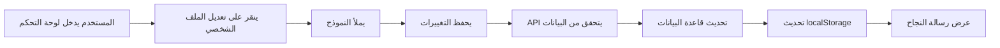
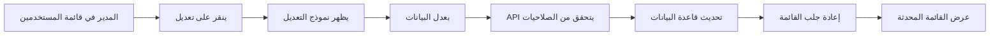

# نظام تعديل بيانات المستخدمين

## الملخص
تم تطبيق نظام كامل لتعديل بيانات المستخدمين مع مستويين:
1. المستخدم العادي: يمكنه تعديل بياناته الشخصية فقط
2. المدير: يمكنه تعديل بيانات أي مستخدم في النظام

## المكونات المضافة

### 1. API Endpoints

#### `/api/user/profile` - للمستخدم العادي
- **GET**: جلب بيانات المستخدم الحالي
- **PUT**: تحديث بيانات المستخدم الحالي
- **المتطلبات**: توكن صالح فقط
- **الحقول القابلة للتعديل**:
  - الاسم
  - البريد الإلكتروني
  - كلمة المرور (مع التحقق من كلمة المرور الحالية)

#### `/api/admin/users/[userId]` - للمدير
- **GET**: جلب بيانات مستخدم محدد
- **PUT**: تحديث بيانات مستخدم محدد
- **DELETE**: حذف مستخدم
- **المتطلبات**: صلاحية `users.update` للتعديل و `users.delete` للحذف
- **الحقول القابلة للتعديل**:
  - الاسم
  - البريد الإلكتروني
  - الدور
  - كلمة المرور (بدون التحقق من القديمة)

### 2. الواجهات

#### صفحة تعديل الملف الشخصي `/dashboard/profile`
- واجهة بسيطة وسهلة الاستخدام
- تحديث البيانات الأساسية
- تغيير كلمة المرور (اختياري)
- رسائل نجاح/خطأ واضحة

#### مكون تعديل المستخدمين `UserEditForm`
- للمديرين فقط
- تعديل جميع بيانات المستخدم
- تغيير الأدوار
- إعادة تعيين كلمة المرور

### 3. التحديثات على المكونات الموجودة

#### لوحة التحكم `/dashboard`
- إضافة زر "تعديل الملف الشخصي"
- سهولة الوصول لصفحة التعديل

#### قائمة المستخدمين `UserList`
- إضافة زر "تعديل" لكل مستخدم
- عرض نموذج التعديل المناسب

## المميزات الأمنية

### 1. التحقق من الهوية
- التحقق من التوكن في جميع العمليات
- التحقق من الصلاحيات للعمليات الإدارية

### 2. حماية كلمة المرور
- المستخدم العادي: يجب إدخال كلمة المرور الحالية
- تشفير كلمات المرور قبل الحفظ
- التحقق من طول كلمة المرور (6 أحرف على الأقل)

### 3. التحقق من البيانات
- منع البريد الإلكتروني المكرر
- التحقق من تطابق كلمة المرور الجديدة

### 4. حماية العمليات الحساسة
- منع المستخدم من حذف حسابه الخاص
- منع حذف آخر مدير في النظام

## تدفق العمليات

### تعديل الملف الشخصي (للمستخدم)


### تعديل مستخدم (للمدير)


## أمثلة الاستخدام

### للمستخدم العادي
```typescript
// تحديث الاسم والبريد
const response = await fetch('/api/user/profile', {
  method: 'PUT',
  headers: {
    'Authorization': `Bearer ${token}`,
    'Content-Type': 'application/json'
  },
  body: JSON.stringify({
    name: 'اسم جديد',
    email: 'new@email.com'
  })
})

// تغيير كلمة المرور
const response = await fetch('/api/user/profile', {
  method: 'PUT',
  headers: {
    'Authorization': `Bearer ${token}`,
    'Content-Type': 'application/json'
  },
  body: JSON.stringify({
    currentPassword: 'oldPass123',
    newPassword: 'newPass456'
  })
})
```

### للمدير
```typescript
// تحديث دور المستخدم
const response = await fetch('/api/admin/users/user-123', {
  method: 'PUT',
  headers: {
    'Authorization': `Bearer ${token}`,
    'Content-Type': 'application/json'
  },
  body: JSON.stringify({
    roleId: 'editor-role-id'
  })
})

// إعادة تعيين كلمة مرور مستخدم
const response = await fetch('/api/admin/users/user-123', {
  method: 'PUT',
  headers: {
    'Authorization': `Bearer ${token}`,
    'Content-Type': 'application/json'
  },
  body: JSON.stringify({
    password: 'newPassword123'
  })
})
```

## رسائل الخطأ

### رسائل شائعة
- "غير مصرح": التوكن غير صالح أو منتهي
- "البريد الإلكتروني مستخدم بالفعل": عند محاولة استخدام بريد مكرر
- "كلمة المرور الحالية غير صحيحة": عند فشل التحقق
- "كلمة المرور الجديدة غير متطابقة": عند عدم تطابق التأكيد
- "ليس لديك صلاحية": للعمليات الإدارية بدون صلاحية

## التحسينات المستقبلية المقترحة

1. **سجل التعديلات**: حفظ تاريخ جميع التعديلات
2. **التحقق بخطوتين**: إضافة OTP عند تغيير البريد الإلكتروني
3. **صورة الملف الشخصي**: إمكانية رفع وتعديل الصورة
4. **الإشعارات**: إرسال إشعار عند تعديل البيانات
5. **التراجع**: إمكانية التراجع عن التعديلات
6. **البحث والفلترة**: في قائمة المستخدمين للمديرين 